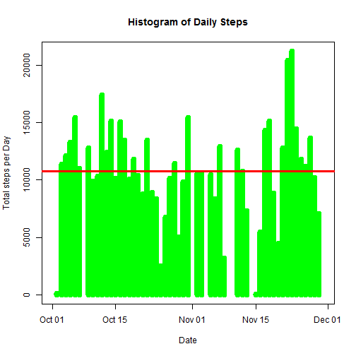
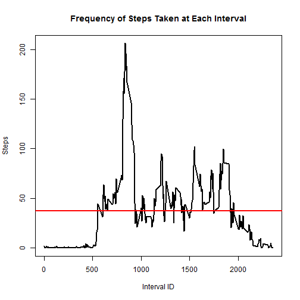
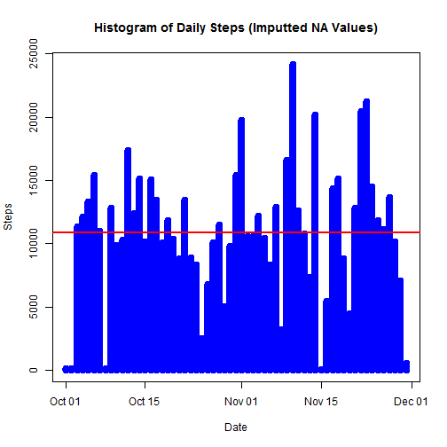
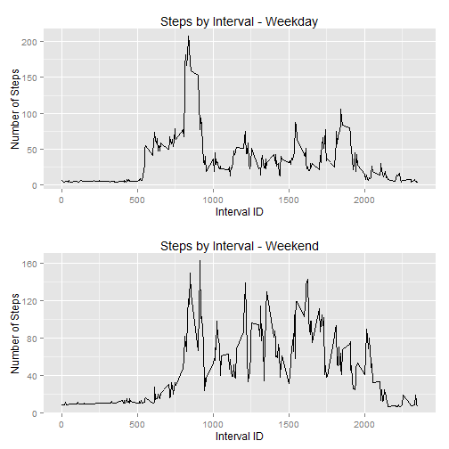

Reproducible Research Project 1
============================================
1. Loading and prepocessing the data

1.1 Load the data from the source file

```r
# Read activity.csv file into variable "activity"
activity <- read.csv("activity.csv")

# Convert date field from factor to date
activity$date <- as.Date(activity$date)
```

1.2 Process/transform the data (if necessary) into a format suitable for your analysis

```r
# Load reshape2 library to get melt & dcast functions
library(reshape2)

# Melt data frame to prep for casting by date -- by setting the id variable to date and the measure variable to steps, we get a table with multiple values for steps taken within each day
actMeltDate <- melt(activity, id.vars="date", measure.vars="steps", na.rm=FALSE)

# Cast data frame to see steps per day -- this sums the steps by date to give us a table of 3 columns x 61 rows
actCastDate <- dcast(actMeltDate, date ~ variable, sum)
```

2. What is mean total number of steps taken per day?

2.1 Make a histogram of the total number of steps taken each day

```r
# Plot histogram with total number of steps by day and add a red line showing the mean value
plot(actCastDate$date, actCastDate$steps, type="h", main="Histogram of Daily Steps", xlab="Date", ylab="Total steps per Day", col="green", lwd=8)
abline(h=mean(actCastDate$steps, na.rm=TRUE), col="red", lwd=3)
```

 

2.2 Calculate and report the mean and median total number of steps taken per day

```r
# Calculate mean and median of daily steps
paste("Mean Steps per Day =", mean(actCastDate$steps, na.rm=TRUE))
```

```
## [1] "Mean Steps per Day = 10766.1886792453"
```

```r
paste("Median Steps per Day =", median(actCastDate$steps, na.rm=TRUE))
```

```
## [1] "Median Steps per Day = 10765"
```

3. What is the average daily activity pattern?

3.1 Make a time series plot (i.e. type = "1") of the 5-minute interval (x-axis) and the average number of steps taken, averaged across all days (y-axis)

```r
actMeltInt <- melt(activity, id.vars="interval", measure.vars="steps", na.rm=TRUE)

# Cast data frame to see mean steps per interval
actCastInt <- dcast(actMeltInt, interval ~ variable, mean)

# Plot line chart with average frequency of steps by interval and add line with mean
plot(actCastInt$interval, actCastInt$steps, type="l", main="Frequency of Steps Taken at Each Interval", xlab="Interval ID", ylab="Steps", col="black", lwd=2)
abline(h=mean(actCastInt$steps, na.rm=TRUE), col="red", lwd=2)
```

 

3.2 Which 5-minute interval, on average across all the days in the dataset, contains the maximum number of steps?

```r
paste("Interval with max value =", actCastInt$interval[which(actCastInt$steps == max(actCastInt$steps))])
```

```
## [1] "Interval with max value = 835"
```

```r
paste("Maximum interval mean steps =", max(actCastInt$steps))
```

```
## [1] "Maximum interval mean steps = 206.169811320755"
```

4.Imputing missing values

4.1 Calculate and report the total number of missing values in the dataset (i.e. the total number of rows with NAs)

```r
sum(is.na(activity$steps))
```

```
## [1] 2304
```

4.2 Devise a strategy for filling in all of the missing values in the dataset
Since there are a considerable number of missing/NA values (2,304), I will replace NAs with the mean for the particular interval number. For example: if the average number of steps taken during interval x is y, I will replace each NA with the corresponding y value for that row). I will then recalculate the steps per day to see how much it differs from the original result (with NAs included), if at all.

4.3 Create a new dataset that is equal to the original dataset but with the missing data filled in

```r
# Data frame with mean steps per interval - just renaming to be more descriptive
stepsPerInt <- actCastInt

# Create data frame that we will remove NAs from
actNoNA <- activity

# Merge activity data set with stepsPerInt data set
actMerge = merge(actNoNA, stepsPerInt, by="interval", suffixes=c(".act", ".spi"))

# Get list of indexes where steps value = NA
naIndex = which(is.na(actNoNA$steps))

# Replace NA values with value from steps.spi
actNoNA[naIndex,"steps"] = actMerge[naIndex,"steps.spi"]
```

4.4 Make a histogram of the total number of steps taken each day and Calculate and report the mean and median total number of steps taken per day

```r
# Melt new data frame to prep for casting by date
actMeltDateNoNA <- melt(actNoNA, id.vars="date", measure.vars="steps", na.rm=FALSE)

# Cast data frame to see steps per day
actCastDateNoNA <- dcast(actMeltDateNoNA, date ~ variable, sum)

# Plot histogram with frequency of steps by day
plot(actCastDateNoNA$date, actCastDateNoNA$steps, type="h", main="Histogram of Daily Steps (Imputted NA Values)", xlab="Date", ylab="Steps", col="blue", lwd=8)
abline(h=mean(actCastDateNoNA$steps), col="red", lwd=2)
```

 

```r
# Calculate mean and median of daily steps
paste("Mean daily steps =", mean(actCastDateNoNA$steps, na.rm=TRUE))
```

```
## [1] "Mean daily steps = 10889.7992576554"
```

```r
paste("Median daily steps =", median(actCastDateNoNA$steps, na.rm=TRUE))
```

```
## [1] "Median daily steps = 11015"
```
Note the difference in values:

Original Data Set (NA values left as is) - Mean daily steps = 10,766.19 - Median daily steps = 10,765

New Data Sets (NAs imputed with mean value for that interval) - Mean daily steps = 10,890 - Median daily steps = 11,015

On a percentage basis, the difference in results between the original and new data sets was only 1.2% and 2.3% for the mean and median, respectively. However, the maximum daily value in the set with NAs vs. the set replacing NAs was 21,194 vs. 24,150, which differed more significantly at 13.9%.

5. Are there differences in activity patterns between weekdays and weekends?

5.1 Create a new factor variable in the dataset with two levels - "weekday" and "weekend" indicating whether a given date is a weekday or weekend day

```r
# For loop to create new column called "dayOfWeek" and insert whether each date corresponds to a weekday or weekend
for (i in 1:nrow(actNoNA)) {
    if (weekdays(actNoNA$date[i]) == "Saturday" | weekdays(actNoNA$date[i]) == "Sunday") {
        actNoNA$dayOfWeek[i] = "weekend"
    } else {
        actNoNA$dayOfWeek[i] = "weekday"
    }
}
```

5.2 Make a panel plot containing a time series plot (i.e. type = "l") of the 5-minute interval (x-axis) and the average number of steps taken, averaged across all weekday days or weekend days (y-axis). The plot should look something like the following, which was creating using simulated data:

```r
# To create a plot, we must first subset the data
actWeekday <- subset(actNoNA, dayOfWeek=="weekday")
actWeekend <- subset(actNoNA, dayOfWeek=="weekend")

# Next, we need to process the data for our needs
actMeltWeekday <- melt(actWeekday, id.vars="interval", measure.vars="steps")
actMeltWeekend <- melt(actWeekend, id.vars="interval", measure.vars="steps")
actCastWeekday <- dcast(actMeltWeekday, interval ~ variable, mean)
actCastWeekend <- dcast(actMeltWeekend, interval ~ variable, mean)

# Load plot packages necessary to continue
library(ggplot2)
library(gridExtra)
```

```
## Warning: package 'gridExtra' was built under R version 3.1.1
```

```
## Loading required package: grid
```

```r
## Loading required package: grid
# Set plot area to two rows and one column, and then plot charts with mean line in each
plot1 <- qplot(actCastWeekday$interval, actCastWeekday$steps, geom="line", data=actCastWeekday, type="bar", main="Steps by Interval - Weekday", xlab="Interval ID", ylab="Number of Steps")
plot2 <- qplot(actCastWeekend$interval, actCastWeekend$steps, geom="line", data=actCastWeekend, type="bar", main="Steps by Interval - Weekend", xlab="Interval ID", ylab="Number of Steps")
grid.arrange(plot1, plot2, nrow=2)
```

 

